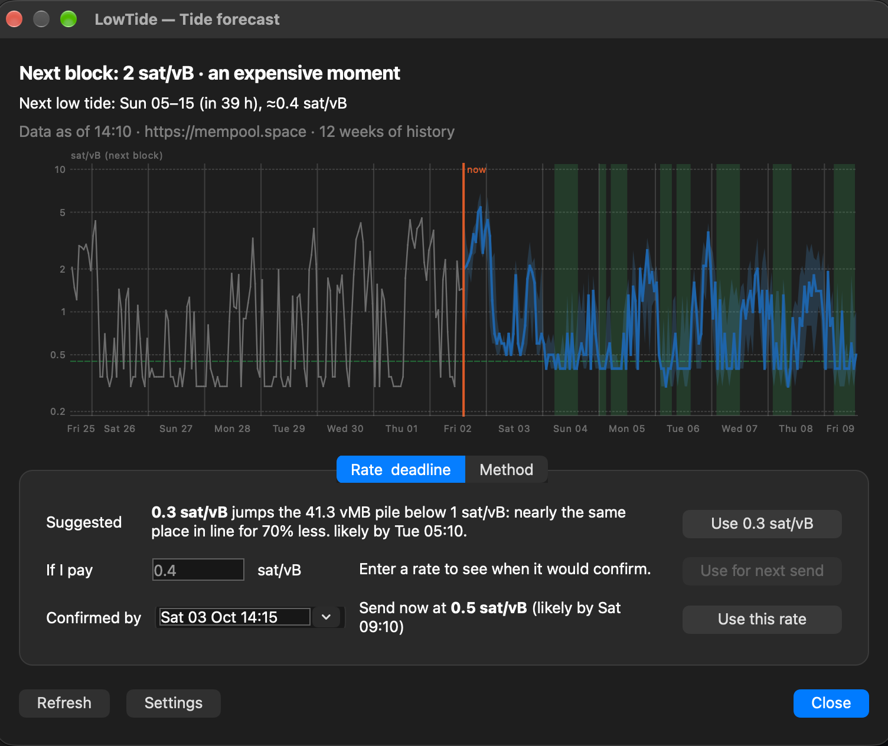
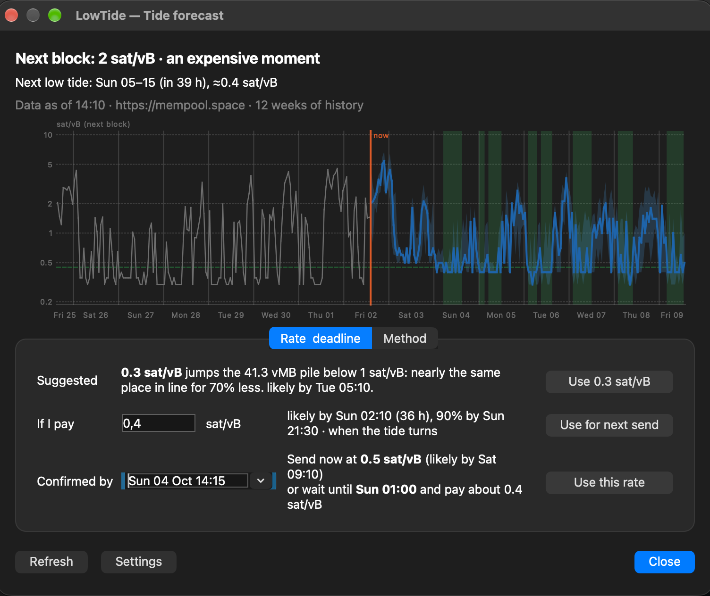
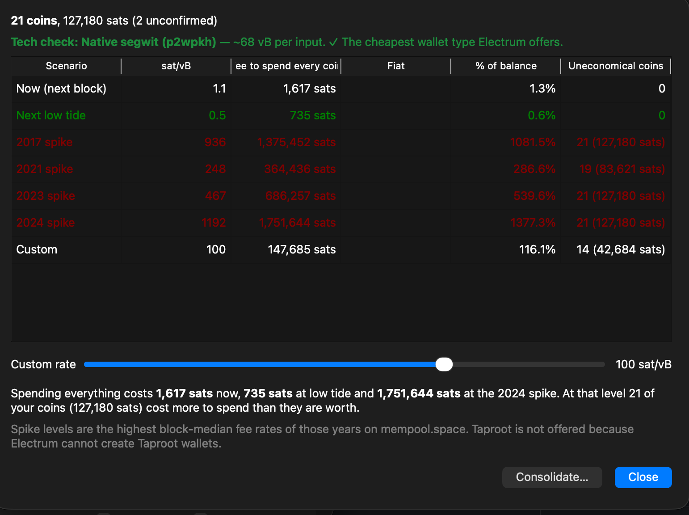
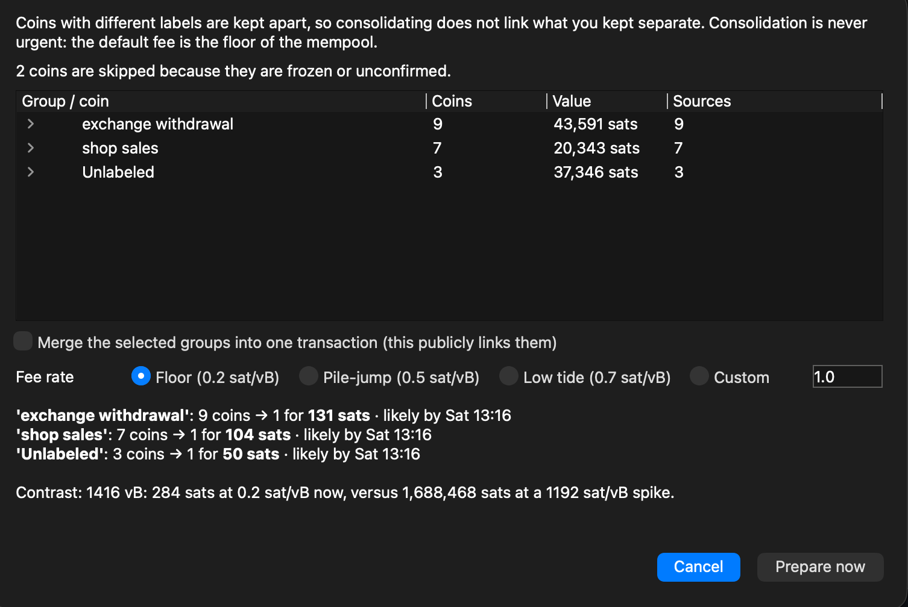
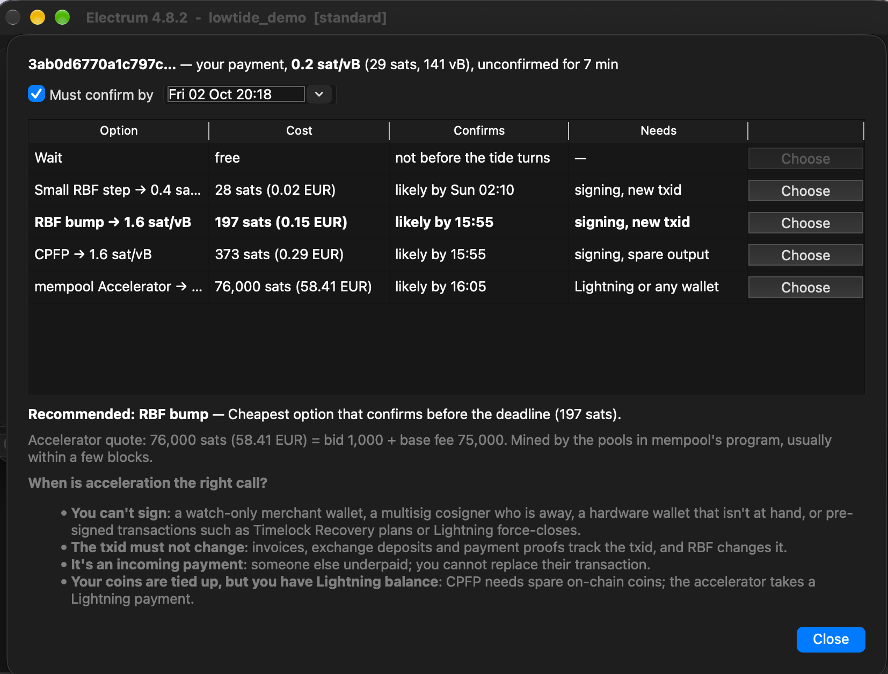

# LowTide

A plugin for the [Electrum](https://electrum.org) Bitcoin wallet that helps you pay less in fees. Bitcoin fees rise and fall like a tide during the week. LowTide tells you when they are low, so you can send, tidy up your coins or fix a stuck payment when it is cheapest. It never moves money on its own: **you always confirm and sign**.

Built at bitcoin++ Berlin 2026.

## What it does

### Fee forecast

Shows when fees will be low over the next week, and notifies you when a cheap window starts. It can suggest a fee below 1 sat/vB, which Electrum does not offer by default, and fill it in for your next payment.

### Rate and deadline check

Type a fee to see when it will likely confirm, or pick a deadline to get the cheapest fee that meets it.

### Stress test

Shows what it would cost to spend your coins today, at the next cheap window, or during a fee spike like those of past years.

### Coin tidy-up

Combines many small coins into fewer while fees are low, without mixing coins you have labelled differently.

### Stuck payment rescue

When a payment is taking too long, compares your options side by side (wait, raise the fee, or pay mempool.space to speed it up) and recommends the cheapest one that meets your deadline.

## Privacy

The forecast uses only public network data, so nothing about your wallet leaves your computer. A transaction is shared with mempool.space only if you ask for a speed-up quote. LowTide follows Electrum's Tor and proxy settings and can use your own mempool server.

## Install

You need Electrum 4.8.2 for desktop. In Electrum, open Tools ▸ Plugins ▸ Add, choose `lowtide-0.1.0.zip` from the releases page, and enable it. Settings are under Tools ▸ LowTide.

## Learn more

[FORECAST.md](FORECAST.md) explains how the forecast works, how accurate it is, and what data it uses.

## Attribution

Although 100 % of the work for this plugin was done during the Berlin Bitcoin++ hackathon, some prior research and ideas have come from my work at Blockonomics.

## License

MIT.
